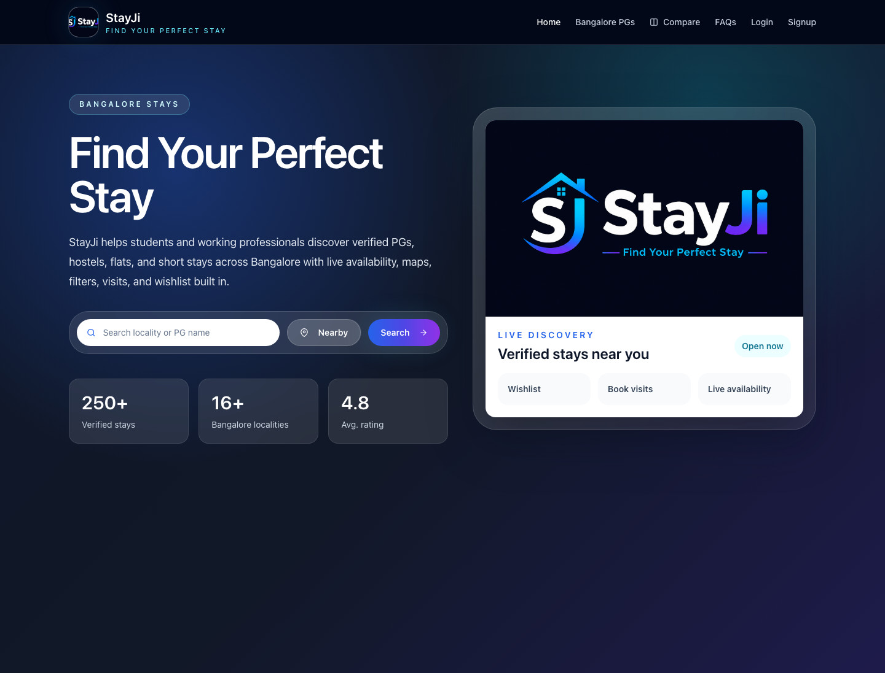
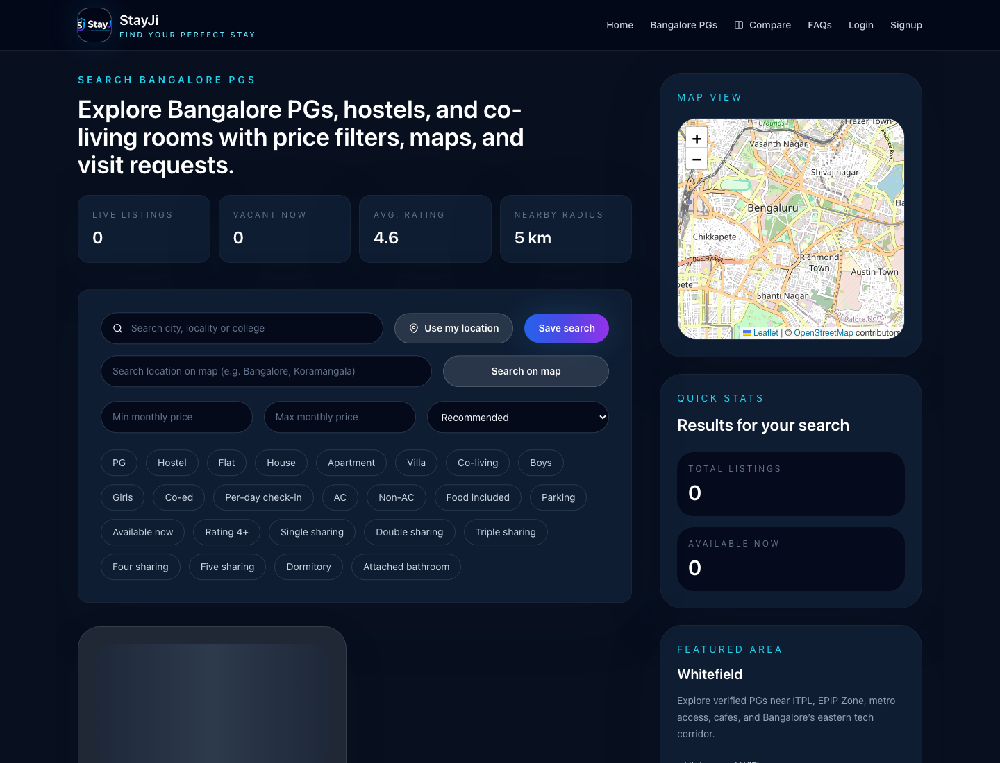

# StayJi User Friendly Project Guide

This guide explains the whole StayJi project in simple language. It is written for users, property owners, admins, testers, and anyone new to the project who wants to understand what each feature does.

StayJi is a Bangalore-first accommodation platform. People can find PGs, hostels, co-living spaces, flats, houses, apartments, villas, and general rental stays. Owners can list and manage their stays. Admins can keep the platform clean, approve changes, manage users, watch leads, manage rewards, and control launch operations.

## Quick Story

Think of StayJi as a stay-finding journey:

1. A user searches for a place.
2. The user compares options and contacts owners.
3. The owner replies, approves visits, and manages availability.
4. The user visits, moves in, and submits proof.
5. The owner confirms the tenant joined.
6. The admin verifies everything, approves rewards, manages payout, and keeps the marketplace trustworthy.

## Screenshots

Real public website screenshots were captured from the local frontend server and saved here:

| Screen | File | What it shows |
| --- | --- | --- |
| Home page | `docs/user-friendly-screenshots/home.png` | Main public entry point and search/navigation area |
| Browse Stays | `docs/user-friendly-screenshots/browse-stays.png` | Property marketplace, search, filters, and listing cards |
| Login | `docs/user-friendly-screenshots/login.png` | User, owner, and admin login entry |

Dashboard screenshots need real role logins and backend data, so the guide marks exactly which dashboard screens should be captured later:

| Dashboard screenshot to add | Suggested file | Open this path after login |
| --- | --- | --- |
| User dashboard | `user-dashboard.png` | `/dashboard/user` |
| User messages | `user-messages.png` | `/dashboard/user/messages` |
| Owner dashboard | `owner-dashboard.png` | `/dashboard/owner` |
| Owner add property | `owner-add-property.png` | `/dashboard/owner/add-property` |
| Owner properties | `owner-properties.png` | `/dashboard/owner/properties` |
| Owner leads | `owner-leads.png` | `/dashboard/owner/leads` |
| Admin dashboard | `admin-dashboard.png` | `/dashboard/admin` |
| Admin users | `admin-users.png` | `/dashboard/admin/users` |
| Admin property detail | `admin-property-detail.png` | `/dashboard/admin/properties/:propertyId` |
| Admin owner detail | `admin-owner-detail.png` | `/dashboard/admin/owners/:ownerId` |
| Admin ads | `admin-ads.png` | `/dashboard/admin/ads` |

## Main Roles

| Role | Simple meaning | Main work |
| --- | --- | --- |
| User | Student, tenant, worker, or anyone searching for a stay | Search, filter, compare, save, message, book visits, move in, request cashback |
| Owner | Person or business listing accommodation | Add properties, update availability, manage leads, approve visits, confirm move-ins |
| Admin | StayJi operations team | Manage users, owners, properties, approvals, rewards, payouts, ads, launch status, and platform quality |

## Public Website

These pages can be opened without dashboard access.

### Home

Path: `/`

The home page is the front door of StayJi. It introduces the product and sends visitors toward property discovery.

What users can do here:

- Understand that StayJi helps find Bangalore stays.
- Start browsing properties.
- Open main navigation such as Home, Bangalore PGs, Compare, FAQs, Login, and Signup.
- Move into SEO/locality content that helps with area decisions.

### Browse Stays

Path: `/properties`

This is the main marketplace page.

Users can:

- Search by property name, city, area, locality, and nearby text.
- Filter by property category such as PG, Hostel, Flat, House, Apartment, Villa, and Co-living.
- Filter by gender type such as Boys, Girls, and Co-ed.
- Filter by AC, Non-AC, parking, food, attached bathroom, rating, availability, and other stay needs.
- Filter by sharing type such as Single, Double, Triple, Four, Five, Dormitory, or custom sharing.
- Set budget range.
- Sort results by recommendation, newest, price, distance, or supported sorting options.
- Use current location or map-style discovery where supported.
- Save a property to wishlist.
- Add properties to comparison.
- Save a search for later.

Easy meaning: this is the "show me good stays" screen.

### Property Detail

Paths: `/properties/:id` and `/property/:id`

This page explains one property deeply.

Users can see:

- Photos and gallery.
- Rent, deposit, daily rate if enabled, and pricing details.
- PG/Flat/Hostel/House/Apartment/Villa/Co-living category.
- Address, area, city, latitude/longitude, and map.
- Gender type and sharing type.
- Room inventory such as single, double, triple, dormitory, vacant beds, and monthly rent.
- Amenities such as WiFi, meals, laundry, security, attached balcony, study table, fridge, washing machine, rooftop access, biometric entry, parking, AC, and custom features.
- Meal options and menu photos if added.
- Video URL if added.
- Ratings, reviews, vacancy, availability date, and trust signals.

Logged-in users can:

- Save to wishlist.
- Add to comparison.
- Message the owner.
- Request a callback or inquiry.
- Book a visit.
- Submit move-in proof after joining.
- Write a review.
- Report a listing if something looks wrong.

Easy meaning: this is the "should I choose this place?" screen.

### Compare

Path: `/compare`

This page is protected, so users must log in.

Users can compare properties side by side by:

- Rent.
- Location.
- Property category.
- Sharing.
- Food.
- Amenities.
- Deposit.
- Availability.
- Rating.
- Owner/trust information.

Easy meaning: this is the "which one is better?" screen.

### Bangalore And Locality Pages

Paths:

- `/bangalore`
- `/bangalore/:localitySlug`

These pages help users understand area-level stay options. They are useful for SEO and for people who search by locality.

They can explain:

- Popular Bangalore areas.
- Nearby stays.
- Rent expectations.
- Commute and lifestyle context.
- Locality-specific PG/flat discovery.

### Blog, Recommendation, And FAQ Pages

Paths:

- `/blogs/:slug`
- `/recommendations/:slug`
- `/faq`
- `/faq/:category`
- `/faq/:category/:faqSlug`

These pages answer questions and guide users with helpful content.

Examples:

- Bangalore rental guide.
- PG selection tips.
- Locality recommendations.
- Safety and payment questions.
- Owner and user policy questions.

### Legal Pages

Paths:

- `/terms-and-conditions`
- `/privacy-policy`
- `/refund-policy`
- `/vendor-policy`
- `/community-guidelines`

These pages explain the rules of the platform in formal language.

## Login And Signup

### Normal Login

Path: `/login`

Users and owners log in from the public login page. The account type must match the selected role.

### Admin Login

Path: `/admin-login`

Admins use a separate admin login route. Admin screens are protected by role.

### Signup

Path: `/signup`

People can create an account as:

- User: for finding a stay.
- Owner: for listing properties.

Owner accounts can require verification or approval before their listings become fully trusted.

### Password Security

Passwords are stored as hashes using bcrypt. Admins cannot see old passwords. If needed, admins can reset a user password and generate a temporary password.

## User Functionality

### User Dashboard

Path: `/dashboard/user`

The user dashboard is the user's personal stay notebook.

It shows:

- Saved properties.
- Visit bookings.
- Comparison history.
- Login history.
- Owner conversations.
- Inquiry history.
- Recently viewed properties.
- Saved searches.
- Rental/move-in history.
- Notifications.
- StayJi Coins and cashback wallet.
- Payout request form.

Easy meaning: this is the "my StayJi activity" screen.

### Wishlist

Users save properties while browsing or viewing details.

Wishlist helps users:

- Keep favorite stays in one place.
- Remove options later.
- Return to properties without searching again.

### Visit Bookings

Users book visits from a property detail page.

Visit statuses:

- Pending.
- Approved.
- Rejected.
- Cancelled.
- Completed.

Users can:

- Check visit status.
- Reschedule a pending visit.
- Cancel a visit.

Owners can:

- Approve visits.
- Reject visits.
- Reschedule visits.
- Mark visit leads as converted.

### Messages

User path: `/dashboard/user/messages`

Users can message owners inside StayJi. A message creates a private conversation and a lead record.

Why this is useful:

- Users do not lose conversation history.
- Owners can track serious inquiries.
- Admins get safer platform records than random outside contact.

### Inquiries

Inquiries are created when users show interest, request callback/contact, message, or book visits.

Inquiry history can include:

- Property name.
- Inquiry text or subject.
- Owner reply.
- Lead status.
- Preferred visit or move-in details.

### Saved Searches

Users can save a search from the Browse Stays page.

A saved search can remember:

- Search text.
- City.
- Locality.
- Budget.
- Sharing preferences.
- Nearby mode.
- Active filters.
- Sort option.

Easy meaning: this is a repeat button for a favorite search.

### Recently Viewed

StayJi remembers properties the user opened recently. This helps users come back to listings they forgot to save.

### Comparison History

When users compare properties, StayJi can store comparison history so previous decisions can be reopened later.

### Move-In Proof

After a user joins a property, they can submit move-in proof.

Move-in proof may include:

- Property.
- Joining date.
- User note.
- Payment screenshot.
- Room image or proof image.

This starts the reward verification process.

### StayJi Coins And Cashback

Cashback/reward flow:

1. User moves into a StayJi-listed property.
2. User submits move-in proof.
3. Owner confirms that the tenant actually joined.
4. Admin verifies the move-in.
5. User reward becomes eligible.
6. User requests payout with UPI or bank details.
7. Admin approves, pays, or rejects payout.

Payout information can include:

- UPI ID.
- UPI QR image.
- Bank details.

Payout statuses:

- Pending.
- Approved.
- Paid.
- Rejected.

### Notifications

Notifications inform users about:

- Visit updates.
- Owner replies.
- Cashback decisions.
- Admin actions.
- Property updates.
- Vacancy changes.

### Profile

Path: `/dashboard/profile`

Users and owners can manage profile information and password from the profile screen.

## Owner Functionality

In some code and older URLs, owner is also called vendor. In the product guide, owner and vendor mean the same type of account.

### Owner Dashboard

Path: `/dashboard/owner`

The owner dashboard is the owner's property control room.

It shows:

- Total properties.
- Active properties.
- Pending approval properties.
- Rejected properties.
- Total visits.
- Total messages.
- Total inquiries.
- Premium status.
- Property views.
- Conversion rate.
- Commission due.
- Vacancy health.
- Recent visit requests.
- Admin messages.
- Move-in confirmation queue.

Quick owner actions:

- My Properties.
- Add Property.
- Messages.
- Bookings/Leads.
- Analytics.
- Subscription/Premium.
- Profile.
- Settings.

### Owner Types And Listing Categories

StayJi supports multiple kinds of owners because different accommodation businesses list different types of properties.

| Owner/listing type | Simple meaning | Example |
| --- | --- | --- |
| PG Owner | Paying guest accommodation manager | Boys PG, Girls PG, Co-ed PG |
| Hostel Owner | Hostel-style accommodation manager | Student hostel, working men's hostel |
| Co-living Owner | Managed shared-living operator | Co-living building with services |
| Flat Owner | Flat owner or shared flat manager | 1BHK, 2BHK, shared flat |
| House Owner | Independent house owner | Full house or room in independent house |
| Apartment Owner | Apartment listing owner | Apartment unit in a society |
| Villa Owner | Villa listing owner | Larger independent villa stay |
| Rent Owner | General rental listing owner | Rental inventory that does not fit one category |

The owner add-property form currently supports these categories:

- PG.
- Flat.
- House.
- Hostel.
- Co-living.
- Apartment.
- Rent.
- Villa.

Some legacy/admin filters can also show Hotel if old data contains it.

### Add Property

Path: `/dashboard/owner/add-property`

Owners add full property details from this screen.

Owners can enter:

- Property name.
- Property category.
- State and city.
- Area/locality.
- Full address.
- Latitude and longitude.
- Rent.
- Deposit.
- Daily rate and per-day check-in option.
- Available beds.
- Vacancy status.
- Available-from date.
- Sharing availability.
- Parking availability.
- AC availability.
- Sharing type.
- Gender type.
- Meals available.
- Amenities.
- Custom amenities.
- Menu photos.
- Property description.
- Image URLs or uploaded images.
- Video.
- Room inventory.
- Custom features.
- Referral agreement acceptance.
- Lead pricing acceptance.
- Owner terms acceptance.

Easy meaning: this is the "create my listing" screen.

### Room Inventory

Owners can describe room options in detail.

Default room rows:

- Single sharing.
- Double sharing.
- Triple sharing.
- Four sharing.
- Five sharing.
- Dormitory.
- Other.

Each room row can include:

- Total rooms.
- Occupied rooms.
- Vacant rooms.
- Beds per room.
- Vacant beds.
- Waiting list.
- Monthly rent.
- Attached/shared bathroom.
- Balcony.
- AC.
- Furnishing type.
- Food preference.
- Gender.

This helps users understand exactly what is available instead of only seeing one rent number.

### Manage Properties

Path: `/dashboard/owner/properties`

Owners can manage their own listings only.

They can:

- Search within their properties.
- Filter by approval status.
- Filter by category.
- Sort by newest, name, price low, or price high.
- View a property.
- Edit a property.
- Open analytics for a property.
- Request delete/archive.
- Update availability quickly.

### Quick Availability Update

Owners can update operational availability without changing sensitive listing data.

Quick updates include:

- Available beds.
- Vacancy status.
- Available-from date.
- Sharing availability.

This is useful when beds fill up or open again.

### Protected Owner Edits

Some fields are sensitive and need admin approval before changing live data.

Protected fields include:

- Property name.
- Property images.
- Address.
- Area/locality.
- City.
- State.
- Latitude.
- Longitude.

Why this matters:

- Prevents fake location changes.
- Keeps users safe from misleading listings.
- Lets admins review important edits.
- Keeps public listings stable.

### Owner Leads

Path: `/dashboard/owner/leads`

Owners can view people who showed interest.

Lead sections:

- Total leads.
- Visit requests.
- Interest messages.
- Wishlist saves.

Owners can:

- View student/user contact details when allowed.
- Approve visit.
- Reject visit.
- Reschedule visit.
- Mark lead as converted.
- Filter leads by property.

Wishlist saves are analytics-only at first. User contact details unlock through stronger actions such as visit, callback, chat, or owner-contact request.

### Owner Messages

Path: `/dashboard/owner/messages`

Owners can reply to users who started property conversations.

### Admin-To-Owner Messages

The owner dashboard can show messages from admins. Owners can reply, and message records can be removed based on supported delete scope.

### Move-In Confirmation

When a user submits proof that they moved in, the owner must confirm the tenant actually joined.

Owner button meaning:

- "Tenant joined successfully" should be clicked only after real confirmation.

Admin reward approval is blocked until owner confirmation is done.

### Commission And Premium

Commission:

- Verified move-ins can create commission tracking.
- Commission is visible in owner move-in conversion information.

Premium:

- Premium properties can receive better priority and badges.
- Admin can enable, extend, disable, or expire premium status.

## Admin Functionality

### Admin Dashboard

Path: `/dashboard/admin`

The admin dashboard is the command center.

It includes:

- Total users.
- Total owners.
- Total properties.
- Pending approvals.
- Premium listings.
- Today's registrations.
- Approved properties.
- Rejected properties.
- Today's visits.
- Monthly visits.
- Unread messages.
- Live/demo/hidden property counts.
- Lead analytics.
- City heatmap.
- Top properties.
- Property operations table.
- Finance tabs.
- Protected property edit review.
- Launch governance controls.

Easy meaning: this is the "run the marketplace" screen.

### Admin Property Management

Admin property table supports:

- Search.
- City filter.
- Locality filter.
- Owner filter.
- Property type filter.
- Property status filter.
- Verification status filter.
- Demo/live filter.
- Approval status filter.
- Active/hidden filter.
- Occupancy filter.
- Date range.
- Sorting.
- Pagination/table actions.

Admins can:

- View property detail.
- Edit property.
- Verify/approve property.
- Reject property.
- Enable premium.
- Extend premium by 30 days.
- Disable or expire premium.
- Hide/unhide property.
- Archive/unarchive property.
- Mark as live.
- Mark as demo.
- Suspend property.
- Run bulk actions on selected properties.

Property states can include:

- LIVE.
- DEMO.
- Public.
- Not public.
- Pending.
- Approved.
- Rejected.
- Suspended.
- Verified.
- Active.
- Archived.
- Hidden.

### Admin Property Detail

Path: `/dashboard/admin/properties/:propertyId`

Admins use this screen for deeper review.

They can inspect:

- Property content.
- Owner profile.
- Verification details.
- Approval status.
- Protected updates.
- Commission configuration.
- Operational status.

### Admin Property Edit

Path: `/dashboard/admin/properties/:propertyId/edit`

Admin can edit property details directly through the same add/edit property form.

### Protected Property Update Review

When owners edit protected fields, StayJi creates an update request.

Admins can:

- See pending requests.
- Compare old values and requested new values.
- Accept only selected fields.
- Approve request.
- Reject request.

This allows partial approval. For example, an admin can approve a new image but reject a suspicious address change.

### Admin User Management

Path: `/dashboard/admin/users`

Admins can manage registered users and owners.

Filters include:

- Search by name, email, phone, or StayJi ID.
- Role: all, users, owners.
- Owner type.
- City.
- Status.
- Demo/live mode.
- Verification status.
- Approval status.

Admins can:

- View user details.
- Edit user details.
- Mark user as dummy/demo.
- Mark user as live.
- Verify owners.
- Suspend users.
- Activate users.
- Reset passwords.
- Run bulk user actions.

### Admin Owner Detail

Paths:

- `/dashboard/admin/vendors/:vendorId`
- `/dashboard/admin/owners/:ownerId`

Admins can inspect one owner in detail.

They can review:

- Owner profile.
- Owner properties.
- Lead performance.
- Verification status.
- Messages with owner.
- Account status.
- Owner activity.

### Admin Lead And Visit Oversight

Admins can view platform lead activity from dashboard analytics and admin APIs.

Lead sources include:

- Visits.
- Inquiries.
- Messages.
- Wishlist interest.
- Callback/owner-contact actions.

### Admin Move-In Review

Admins review move-in proof after the user submits it and owner confirms joining.

Admins can mark move-ins as:

- Pending.
- Verified.
- Suspicious.
- Rejected.

Verification can affect:

- User reward coins.
- Cashback eligibility.
- Commission tracking.
- Payout ability.

### Admin Wallet Payouts

Admins review user payout requests.

They can:

- View payout details.
- Check UPI ID.
- Check UPI QR.
- Check bank details.
- Approve payout.
- Mark payout paid.
- Reject payout.

### Admin Ads

Path: `/dashboard/admin/ads`

Admins can manage sponsored advertisements.

They can create/edit:

- Agency or company name.
- Ad title.
- Description.
- Image URL.
- Destination URL.
- Placement.
- Start date/time.
- End date/time.
- Priority.
- Price.
- Billing status.
- Internal notes.
- Active/archive status.

Supported placements:

- All compatible sidebars.
- Home page sponsored section.
- Browse Stays right sidebar.
- Listing sidebar alias.
- Bangalore locality right sidebar.
- Property detail right sidebar.

Admins can also:

- Preview public ad slots.
- Search campaigns.
- Filter active/archived ads.
- Download campaign CSV.
- Track impressions, clicks, CTR, and campaign value.

### Admin Launch Governance

Admins can manage Bangalore launch state and demo/live transition.

Governance functionality includes:

- City/state launch rows.
- Assigned admins.
- Launch city.
- Hide demo properties.
- Hide dummy users.
- Mark data live or demo.
- View audit logs.

Easy meaning: this helps StayJi move from demo inventory to real marketplace inventory safely.

## Important Data Concepts

### Property Data

A property can store:

- Owner ID.
- Property name.
- Description.
- Address.
- Rent.
- Sharing.
- Gender type.
- Area/locality.
- City/state.
- Coordinates.
- Property type/category.
- Amenities.
- Meals.
- Menu photos.
- Property images.
- Video.
- Deposit.
- Available beds.
- Room inventory.
- Security features.
- Nearby landmarks.
- Review summary.
- Commission configuration.
- Owner agreements.
- Rating.
- Premium status.
- Approval status.
- Demo/live state.
- Verification state.
- Active/archive/suspended state.

### User Data

A user/owner/admin account can include:

- Name.
- Email.
- Phone.
- Role.
- Profile.
- Account status.
- Verification status.
- Approval status.
- Dummy/live mode.
- City/state assignment.
- Business name.
- Owner/vendor type.
- Login history.
- Notification preferences.

### Lead Data

Lead information can come from:

- Visit bookings.
- Inquiries.
- Messages.
- Shortlists.
- Move-ins.
- Owner/admin actions.

## Full Workflows

### User Finds A Stay

1. User opens Home.
2. User goes to Browse Stays.
3. User searches locality or property name.
4. User applies filters like budget, gender, sharing, food, AC, parking, and availability.
5. User opens property detail.
6. User checks photos, rent, rooms, map, amenities, and rules.
7. User saves to wishlist or compares options.
8. User messages owner or books a visit.
9. Owner responds or approves the visit.
10. User visits and decides.

### User Moves In And Gets Cashback

1. User moves into a StayJi property.
2. User submits move-in proof.
3. Owner confirms tenant joined.
4. Admin verifies the move-in.
5. StayJi Coins/cashback become eligible.
6. User requests payout.
7. Admin reviews payout details.
8. Admin approves or pays payout.

### Owner Lists A Property

1. Owner signs up or logs in.
2. Owner opens Owner Dashboard.
3. Owner clicks Add Property.
4. Owner fills name, type, location, rent, rooms, amenities, photos, and agreements.
5. Property is submitted.
6. Admin reviews and approves/rejects.
7. Approved property becomes searchable.
8. Users save, message, compare, and book visits.
9. Owner manages leads and availability.

### Owner Updates Availability

1. Owner opens Manage Properties.
2. Owner clicks Availability.
3. Owner updates beds, vacancy status, available date, or sharing availability.
4. The update goes live quickly because it is operational data.

### Owner Requests Sensitive Edit

1. Owner edits protected details like address, images, city, locality, or coordinates.
2. StayJi creates a protected update request.
3. Admin opens the update review queue.
4. Admin accepts selected fields or rejects the request.
5. Only approved fields become live.

### Admin Approves A Property

1. Admin opens Admin Dashboard.
2. Admin filters Pending Approval properties.
3. Admin opens the property or uses quick table actions.
4. Admin verifies content, owner, photos, location, pricing, and safety signals.
5. Admin approves, rejects, hides, suspends, or marks premium.
6. The property visibility changes accordingly.

### Admin Manages Users And Owners

1. Admin opens Manage Users.
2. Admin searches by name, email, phone, or StayJi ID.
3. Admin filters by role, status, verification, city, or demo/live mode.
4. Admin views or edits the account.
5. Admin verifies owner, suspends account, activates account, marks dummy/live, or resets password.

### Admin Manages Ads

1. Admin opens Admin Ads.
2. Admin creates campaign with agency, title, image, destination, placement, schedule, priority, and price.
3. Admin previews public slot.
4. Campaign appears in selected placement when active.
5. Admin tracks impressions, clicks, CTR, and value.
6. Admin edits, archives, reactivates, or exports CSV.

## Best Way To Explain StayJi In One Minute

StayJi helps Bangalore users find trusted stays. Users search, compare, save, message, book visits, and claim rewards after move-in. Owners list PGs, flats, hostels, co-living spaces, houses, apartments, villas, or rental properties, then manage leads and availability. Admins control quality by approving listings, reviewing protected edits, managing users and owners, verifying move-ins, handling payouts, managing ads, and moving inventory from demo to live.

